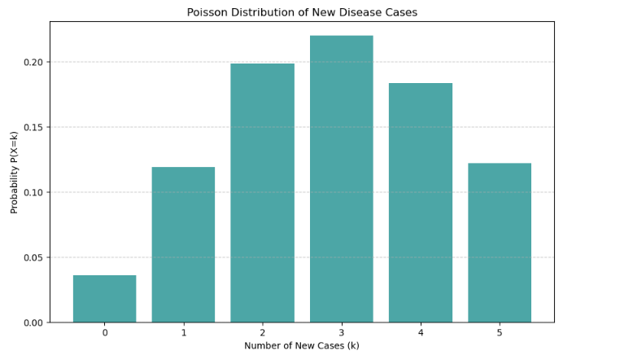

# Project3-STM-New-Cases-Estimation-Using-Poisson-Distribution
> **Brief Description:** Predict new diseases cases based on Poisson Distribution.

---

## Table of Contents

- [Description](#description)
- [Video Explanation](#video)
- [Technologies Used](#technologies-used)
- [Dataset](#dataset)
- [Program Codes ](#program-codes)
- [Screenshots](#screenshots)
- [Contribution](#contributipn)
- [Contact Details](#contact-details)

---

## Description

A healthcare scenario where a hospital wants to estimate the incidence of a rare disease, such as a particular type of cancer, in their region. The goal is to predict how many new cases will be reported in a month based on historical data.

## Video

## Technologies-used

Python programming language, pandas and matplotlib package.

## Dataset

The data set is synthetically generated and used for demonstrating the concept only. The program can be easily modified to show results with real readings taken from the patients.

## Program-codes

The programs are written on jupiter notebook, You may run the program on Google colab by clicking on the colab badge below.

## Screenshots

## Contribution

The programs are written by Santanu Karmakar

## Contact-details

If you wish to contact me, please leave a message (Preferably WhatsApp) on this number: 6291 894 897.
Please also mention why you are contacting me. Include your name and necessary details.
Thank you for taking an interest.
